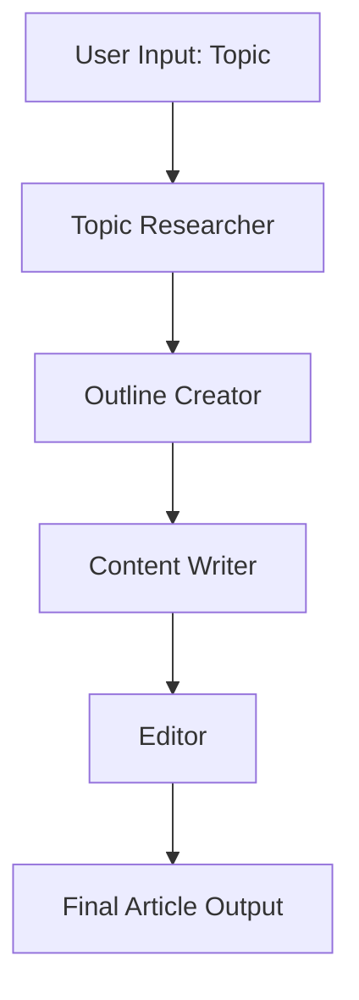

# MultiAgents-Using-CrewAI
#  Multi-Agent Content Writer System using CrewAI

A fully autonomous multi-agent system that collaborates to generate high-quality, structured content using LLMs and CrewAI. This system simulates a real-world editorial workflow with distinct roles: **Topic Researcher**, **Outline Creator**, **Content Writer**, and **Editor**, all working together in a coordinated pipeline.

---

##  Overview

This project demonstrates how **LLMs** can work collaboratively through **CrewAI** agents to produce human-like articles with minimal prompt engineering. Each agent is assigned a specific task, enabling modular, scalable, and reusable content generation workflows.

---

##  Tech Stack

| Component      | Tool / Library          |
|----------------|-------------------------|
| Multi-Agent Orchestration | [CrewAI](https://github.com/joaomdmoura/crewAI) |
| Language Model | OpenAI GPT / Gemini / Local LLM |
| Notebook IDE   | Google Colab / Jupyter |
| Programming    | Python 3.10+            |
| Agent Roles    | Researcher, Outliner, Writer, Editor |

---

##  Architecture


## Agents & Roles
 - Topic Researcher: Gathers information and facts about the given topic.

 - Outline Creator: Breaks down the research into a structured article format.

 - Content Writer: Writes detailed paragraphs based on the outline.

 - Editor: Improves grammar, flow, coherence, and adds final touches.

## Setup Instructions:

1. Clone the repo
- git clone https://github.com/your-username/multi_agent_content_writer.git
cd multi_agent_content_writer

2. Install dependencies
- pip install -r requirements.txt

3.Set your API keys (for OpenAI/Gemini etc.)

- export OPENAI_API_KEY="your-api-key"

  ## ⚙️ CrewAI Agent-Based Workflow Syntax

Below is a quick breakdown of how CrewAI works through `Agent`, `Task`, and `Crew` components.

###  Agent

Each agent is initialized with a specific **role**, **goal**, and optional **backstory**, and powered by an LLM.

| Component  | Description                                                               |
|------------|---------------------------------------------------------------------------|
| `role`     | The persona or job title of the agent (e.g., "Content Writer")           |
| `goal`     | The high-level mission the agent aims to achieve                         |
| `backstory`| The agent’s knowledge domain or specialization for contextual reasoning  |
| `llm`      | The language model used to power the agent (e.g., GPT-4, Gemini)          |

```python
from crewai import Agent

agent = Agent(
    role="Content Writer",
    goal="Write engaging and SEO-friendly content",
    backstory="A skilled writer with a knack for clarity and creativity.",
    llm=llm
)
```


### Task
A Task defines a unit of work assigned to a specific agent, with a clear description and expected outcome.

| Field  | Description                                                               |
|------------|---------------------------------------------------------------------------|
| `description`     | Clear instructions about the task          |
| `expected_output`     | The format or criteria the output should meet                       |
| `agent`| The agent responsible for executing this task |

```python
from crewai import Task

write_article_task = Task(
    description="Write a 1000-word article about the benefits of AI in content marketing.",
    expected_output="A full blog post with a title, introduction, body, and conclusion.",
    agent=writer_agent
)

```
### Crew
A Crew orchestrates collaboration by grouping agents and their tasks into a cohesive workflow. It manages task execution order, agent interaction, and overall coordination.


| Field  | Description                                                               |
|------------|---------------------------------------------------------------------------|
| `agents`     |       A list of all Agent instances involved in the workflow |
| `tasks`     | A list of Task instances to be executed|
| `verbose`|Optional flag to display intermediate logs (useful for debugging) |

```python
from crewai import Crew

content_crew = Crew(
    agents=[writer_agent, seo_agent, editor_agent],
    tasks=[blog_task, seo_task, editing_task],
    verbose=True
)
result = content_crew.kickoff()
print(result)

```

